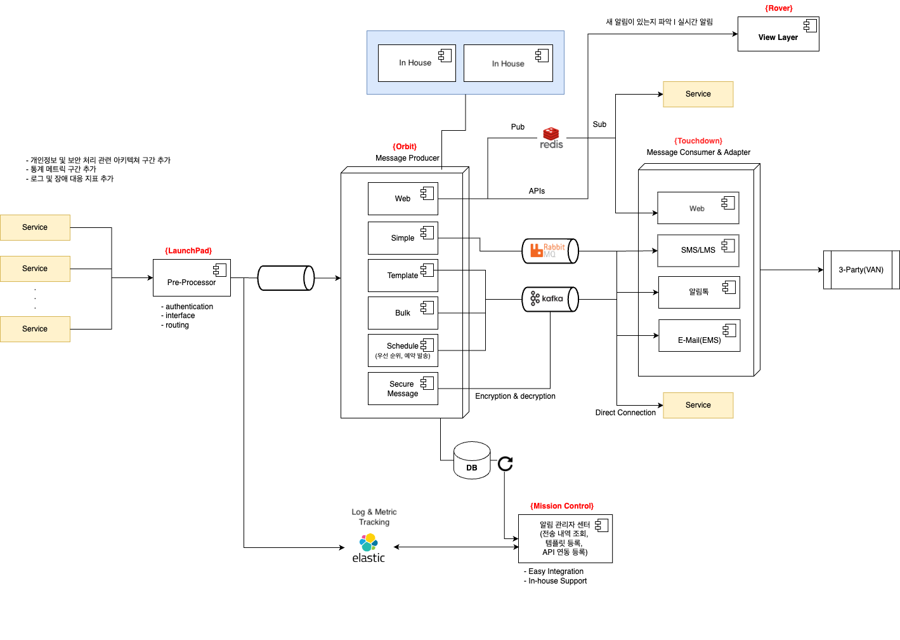

# Portfolio Sample
Sample Developer Portfolio for Job Seekers and Career Changers

## 프로젝트 목표

> 사내 메시지 발송기를 통합하여 여러 부서에 파편화된 리소스를 공통 플랫폼으로 전환하여 효율화   
> 메시지 중요도와 발송량에 따라 기존 장비를 활용하고 고속, 고용량의 경우 고사양 장비 활용    
> 다양한 포멧의 메시지를 지원하여 대외로 나가는 모든 메시징 통합 
>

<aside>
💡 <b>운영 리소스 50% 감소 및 메시지 발송 증가에 따른 발송 지연 CS 비용 해소</b>
</aside>

## 아키텍처

## 개발 스택
> JDK 1.8  
> SpringBoot 3.x   
> Elasticsearch 8.x   
> Kafka 3.x   
> Redis 7.x   
> RabbitMQ 3.10.x   
> MongoDB 6.x  

## 핵심 기능 
>
>전체 발송 메시징 적재 후 retryable 처리, 실패시 메뉴얼 발송 가능  
> 메시지 가중치 스펙 도입, 메시지 타입 및 조건에 따라 처리 성능별 Producer 분배  
> Redis Pub/Sub 을 이용한 웹 알림 View Plugin 모듈 제공 (재개발 필요없이 CSS만 수정하여 커스텀)  
> 메시지 전송과 서비스 비즈니스의 격리, 발송 규격 및 메시지 팀플릿 등록 후 인하우스 유저가 권한 획득하여 발송  
> 발송 히스토리는 관리자 화면에서 실시간으로 확인
